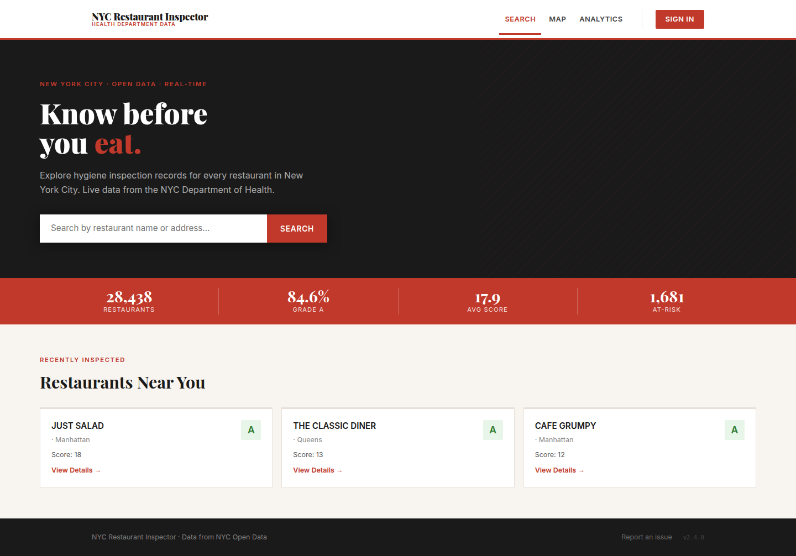
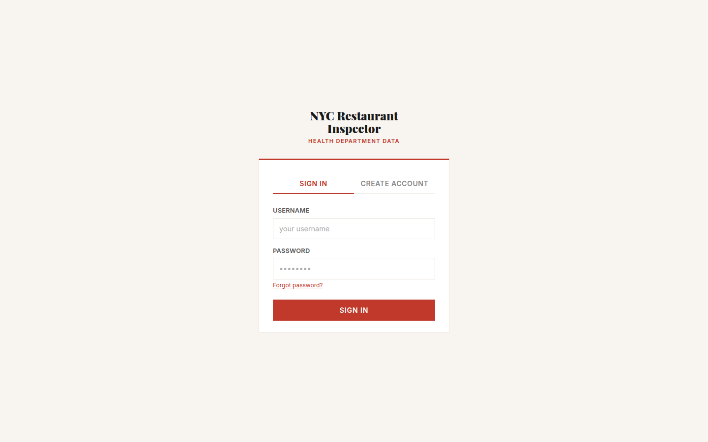
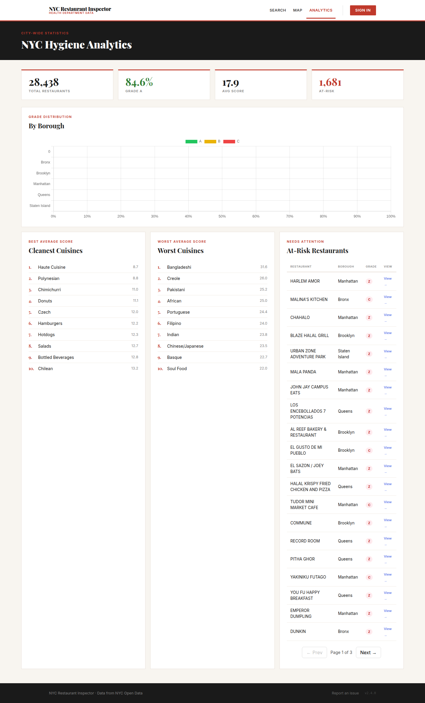
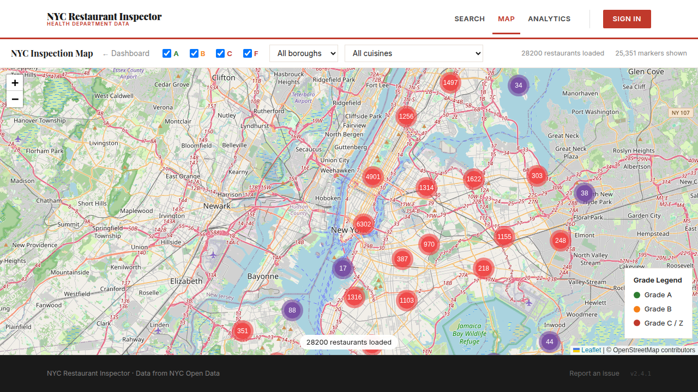
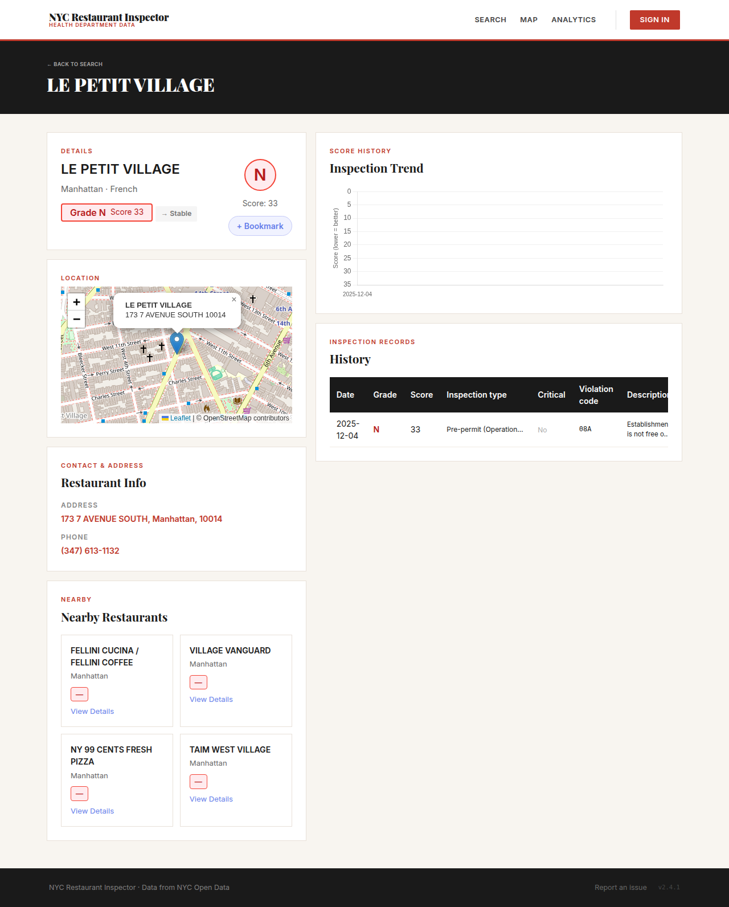
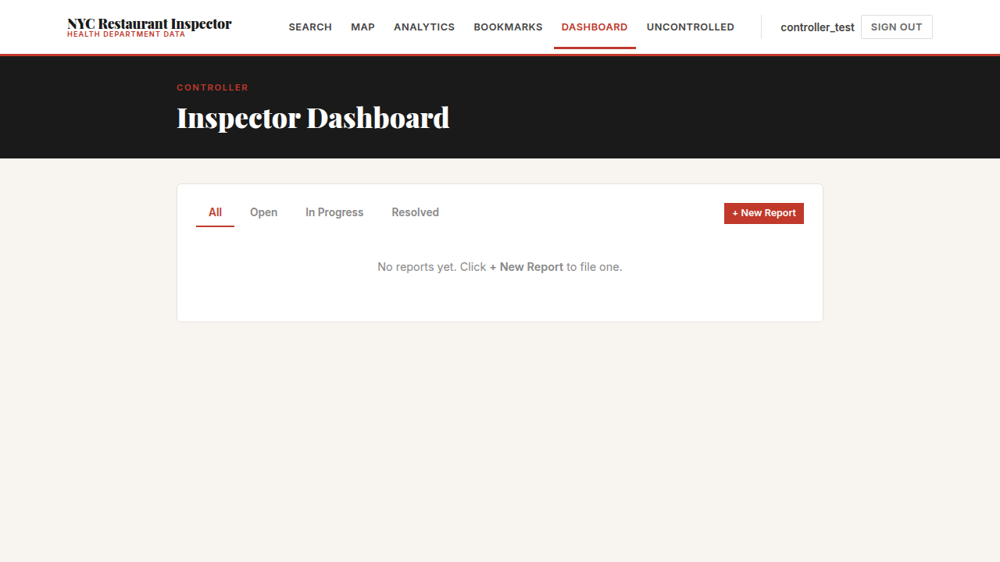
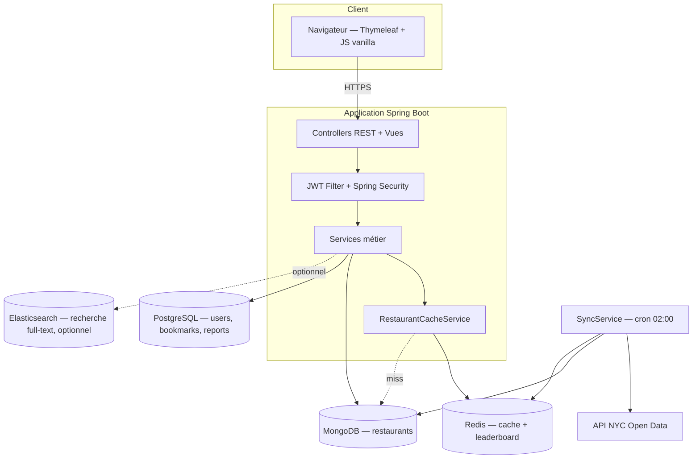

# Cahier des charges techniques

**Certification** : RNCP niveau 7 — Expert en informatique et système d'information (3W Academy)
**Bloc** : 2 — Piloter et manager les projets informatiques
**Livrable** : Cahier des charges techniques
**Candidat** : Arnaud Thery
**Application de référence** : `restaurant-analytics` — code source sur GitHub, démo déployée sur Railway

---

## 1. Spécifications fonctionnelles détaillées

L'application permet d'explorer les inspections d'hygiène des restaurants new-yorkais, synchronisées en continu depuis l'API NYC Open Data, avec quatre profils d'utilisation.

### 1.1 Visiteur anonyme

| Fonction | Détail |
|---|---|
| Recherche de restaurants | Par nom ou adresse, avec suggestions en temps réel (Elasticsearch quand actif, dégradation propre sinon) |
| Consultation d'une fiche restaurant | Grade sanitaire courant, historique des scores, carte de localisation, restaurants à proximité |
| Carte interactive | Marqueurs colorés par grade (A/B/C/Z), clustering, filtres borough/cuisine |
| Statistiques globales | KPI ville entière, classement des cuisines les plus/moins hygiéniques, distribution des grades par borough |
| Restaurants non contrôlés | Liste des établissements sans inspection depuis 12 mois ou notés C/Z, export CSV |

### 1.2 Client authentifié (`ROLE_CUSTOMER`)

| Fonction | Détail |
|---|---|
| Compte | Inscription, connexion, mot de passe oublié (email via Resend), suppression de compte RGPD |
| Tableau de bord personnel | Restaurants favoris, restaurants à proximité (géolocalisation navigateur), KPI ville |
| Favoris | Ajout/suppression d'un restaurant en favori |

### 1.3 Contrôleur (`ROLE_CONTROLLER`)

| Fonction | Détail |
|---|---|
| Inscription contrôlée | Code d'inscription requis (`CONTROLLER_SIGNUP_CODE`) |
| Rapports d'hygiène | Création, consultation, édition d'un rapport (grade, statut, codes de violation, notes, photo) |
| Suivi | Filtrage des rapports par statut (Open / In Progress / Resolved) |

### 1.4 Administrateur (`ROLE_ADMIN`)

| Fonction | Détail |
|---|---|
| Inscription contrôlée | Code d'inscription requis (`ADMIN_SIGNUP_CODE`) |
| Supervision des tâches planifiées | État des jobs cron (`GET /api/admin/cron/status`) |
| Synchronisation | Déclenchement manuel du sync NYC Open Data, reconstruction du cache Redis |
| Statistiques de rapports | Comptages par statut et par grade sur l'ensemble des rapports soumis |

Référentiel complet des endpoints : [`docs/api.md`](../docs/api.md).

---

## 2. Contenu des écrans

Captures prises sur l'environnement de production (`restaurant-app-production-3b11.up.railway.app`, v2.4.1).

### 2.1 Page d'accueil (visiteur anonyme) — `landing.html`



Hero avec accroche, barre de recherche avec suggestions à la frappe, bandeau de 4 KPI (total restaurants, % grade A, score moyen, nombre à risque), grille de restaurants récemment inspectés.

### 2.2 Connexion / Inscription — `login.html`



Deux onglets (Sign In / Create Account), lien "Forgot password?" vers le flux de réinitialisation par email.

### 2.3 Analytics ville entière — `analytics.html`



KPI globaux, graphique de distribution des grades par borough (Chart.js), classement des 10 cuisines les plus propres et les 10 plus à risque, table paginée des restaurants à risque.

### 2.4 Carte d'inspection — `inspection-map.html`



Carte Leaflet avec clustering, marqueurs colorés par grade, filtres par borough/cuisine/grade, légende. Page publique (aucune authentification requise).

### 2.5 Fiche restaurant — `restaurant.html`



Badge de grade courant, carte de localisation, historique des scores (graphique de tendance), tableau détaillé des inspections, restaurants à proximité (rayon 500 m), bouton favori (si connecté).

### 2.6 Tableau de bord contrôleur — `dashboard.html`



Liste des rapports du contrôleur connecté, filtrable par statut, création via une modale "New Report" (recherche de restaurant, grade, statut, notes, upload photo).

Pages non capturées ici (accès restreint, contenu analogue en structure aux écrans ci-dessus) : `/profile`, `/my-bookmarks`, `/admin`. Référence complète des 11 routes : [`docs/ui.md`](../docs/ui.md).

---

## 3. Contenu des bases de données

Deux bases aux rôles disjoints : MongoDB pour les données restaurants (volumineuses, en lecture majoritaire, resynchronisées depuis une source externe), PostgreSQL pour les données utilisateur (transactionnelles, propriétaires).

### 3.1 MongoDB — `newyork.restaurants`

Un document par restaurant (`restaurant_id` = camis NYC), grades embarqués :

```json
{
  "restaurant_id": "30075445",
  "name": "Morris Park Bake Shop",
  "cuisine": "Bakery",
  "borough": "Bronx",
  "address": { "building": "1007", "street": "Morris Park Ave", "zipcode": "10462", "coord": [-73.856077, 40.848447] },
  "grades": [ { "date": "2014-03-03T00:00:00.000", "grade": "A", "score": 2, "violation_code": "10F", "critical_flag": "Not Critical" } ]
}
```

Choix structurants : document unique par restaurant plutôt qu'une collection séparée par inspection (évite les jointures pour l'affichage d'une fiche) ; coordonnées en GeoJSON `[longitude, latitude]` pour les requêtes `$geoNear` ; grades dédupliqués par date d'inspection à l'ingestion (l'API source expose une ligne par violation, potentiellement plusieurs par inspection).

Index recommandés : `restaurant_id` (unique), `borough`, `cuisine`, `address.coord` (2dsphere).

### 3.2 PostgreSQL — géré par Hibernate (`ddl-auto=update`)

| Table | Colonnes clés | Rôle |
|---|---|---|
| `users` | `username` (UNIQUE), `email` (UNIQUE), `password_hash` (BCrypt), `role` | Comptes, tous rôles confondus |
| `bookmarks` | `user_id` (FK), `restaurant_id`, UNIQUE(`user_id`, `restaurant_id`) | Favoris client |
| `inspection_reports` | `user_id` (FK), `restaurant_id`, `grade`, `status`, `violation_codes`, `notes`, `photo_path` | Rapports contrôleur |
| `password_reset_tokens` | `user_id` (FK), `token_hash`, `expires_at`, `used_at` | Jetons de réinitialisation à usage unique (1h) |
| `audit_log` | `user_id`, `action`, `created_at` | Traçabilité des actions administrateur et RGPD |

Schéma détaillé et arbitrages : [`docs/architecture.md`](../docs/architecture.md).

### 3.3 Redis (cache, non persistant)

Clés `restaurants:*` (agrégations mises en cache, TTL 1h) et un sorted-set `restaurants:top` (leaderboard des restaurants les plus sains). Invalidé intégralement à chaque synchronisation réussie.

---

## 4. Environnement informatique choisi et justifié

| Choix | Alternative envisagée | Justification |
|---|---|---|
| **Java 25 + Spring Boot 4.0.5** | Node.js/Express | Écosystème mature pour la sécurité (Spring Security), l'accès aux données (JPA, driver MongoDB officiel) et les tests (JUnit/Mockito) — critère du référentiel Bloc 4A sur la maîtrise de la cybersécurité |
| **MongoDB (driver brut, sans Spring Data)** | PostgreSQL seul | Le jeu de données NYC Open Data est un flux de lignes hétérogènes (une ligne par violation) qu'il faut regrouper en documents par restaurant — modèle document plus naturel que relationnel pour ce cas ; le driver brut évite la couche d'abstraction Spring Data quand les agrégations sont déjà complexes (pipelines `$group`, `$geoNear`) |
| **PostgreSQL + JPA** | MongoDB pour tout | Données utilisateur intrinsèquement relationnelles (contraintes d'unicité, clés étrangères, transactions ACID sur la suppression de compte RGPD) |
| **Redis** | Cache applicatif in-memory (Caffeine) | Partagé entre instances si l'application est scalée horizontalement ; sorted-set natif pour le leaderboard sans requête MongoDB répétée |
| **JWT (access 15 min / refresh 7 j) en cookies httpOnly** | Session serveur classique | Stateless (pas de session partagée à synchroniser entre instances) ; migration ultérieure de `localStorage` vers cookies httpOnly pour fermer le risque d'exfiltration XSS des tokens |
| **Docker Compose (dev) / Railway (prod)** | Kubernetes | Complexité de Kubernetes non justifiée pour un service unique à trafic modéré ; Railway fournit le déploiement continu et la détection automatique du build Maven sans configuration d'orchestrateur |
| **Elasticsearch (optionnel, coupé en production)** | Recherche full-text MongoDB (`$text`) | Autocomplete avec edge-ngram plus pertinent qu'un index texte MongoDB, mais fonctionnalité non critique — le service a été arrêté en production pour réduire le coût mémoire (~1 Go) au profit de la recherche MongoDB de base, qui reste pleinement fonctionnelle |

---

## 5. Interactions entre composants



Flux détaillés (synchronisation nocturne, lecture HTTP, authentification) : [`docs/architecture.md`](../docs/architecture.md).

---

## 6. Plan de développement logiciel

Le projet suit un cycle **spec → plan → implémentation** par fonctionnalité (méthode Superpowers), documenté dans `docs/superpowers/specs/` et `docs/superpowers/plans/` — un couple de fichiers par fonctionnalité livrée (ex. `2026-07-27-forgot-password-design.md` + `2026-07-27-forgot-password.md`).

Chaque fonctionnalité suit systématiquement :
1. **Brainstorm** — clarification du besoin et des contraintes avant toute écriture de code
2. **Spec** — document de conception (approche technique, alternatives écartées)
3. **Plan** — étapes d'implémentation, découpées en commits atomiques
4. **Implémentation** — sur une branche dédiée (`feature/<sujet>`), avec tests
5. **Revue** — CI complète (build, tests unitaires, tests d'intégration, scan de secrets, E2E) avant fusion sur `main`
6. **Documentation** — mise à jour de `CHANGELOG.md` et de la documentation technique concernée

Découpage historique du projet (reconstitué depuis `CHANGELOG.md`, détaillé au Bloc 2.3) : infrastructure des rôles (mars 2026) → découverte client (mars-avril 2026) → durcissement sécurité et CI (avril-mai 2026) → recherche et enrichissement (mai 2026) → sécurité et conformité RGPD (juillet 2026, v2.3.0-2.4.1).

Depuis la v2.4.1, la mise à jour de version (`app.semver`) et la préparation du `CHANGELOG.md` sont partiellement automatisées par un workflow GitHub Actions à déclenchement manuel (`.github/workflows/release.yml`), qui ouvre une pull request de release — le contenu du changelog reste rédigé à la main (une tentative antérieure de génération automatique complète via `git-cliff` avait été abandonnée au profit d'entrées narratives).

---

## Renvoi croisé

- Spécifications API complètes : [`docs/api.md`](../docs/api.md)
- Architecture et modèles de données : [`docs/architecture.md`](../docs/architecture.md)
- Configuration : [`docs/configuration.md`](../docs/configuration.md)
- Déploiement : [`docs/deployment.md`](../docs/deployment.md)
- Dossier de conception (UML) : [`bloc3-1-dossier-conception.md`](bloc3-1-dossier-conception.md)
- Dossier technique (tests, sécurité, maintenance) : [`bloc3-2-dossier-technique.md`](bloc3-2-dossier-technique.md)
