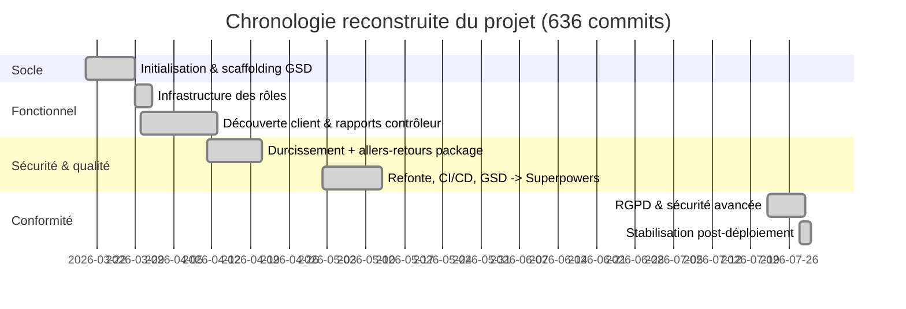

# Dossier de planification d'un projet informatique (+ bilan)

**Certification** : RNCP niveau 7 — Expert en informatique et système d'information (3W Academy)
**Bloc** : 2 — Piloter et manager les projets informatiques
**Livrable** : Dossier de planification (inclut le bilan)
**Candidat** : Arnaud Thery
**Projet** : `restaurant-analytics`

> Comme pour la note de cadrage (Bloc 2.2), ce document reconstitue a posteriori une planification qui n'a pas été formalisée a priori — le projet a été mené en développement solo itératif, sans jalons fixés à l'avance. Les phases ci-dessous sont reconstruites à partir de l'historique Git réel (636 commits, 2026-03-20 → 2026-07-29) et de `CHANGELOG.md`, pas d'une intention projetée.

---

## Partie 1 — Planification

### 1.1 Phases du projet

| Phase | Période | Durée | Contenu |
|---|---|---|---|
| **0 — Socle initial** | 2026-03-20 → 2026-03-29 | 9 j | Premier commit (API Spring Boot), scaffolding méthodologique GSD (`.planning/`) |
| **1 — Infrastructure des rôles** | 2026-03-29 → 2026-03-31 | 3 j | `ROLE_CUSTOMER`/`ROLE_CONTROLLER`, JWT access/refresh, rate limiting, comptes de test (`DataSeeder`) |
| **2 — Découverte client & rapports** | 2026-03-30 → 2026-04-12 | 14 j | Recherche, carte interactive, favoris, rapports d'hygiène contrôleur, upgrade Java 11→25 et Spring Boot 2.6→4.0, migration Testcontainers |
| **3 — Durcissement sécurité** | 2026-04-11 → 2026-04-20 | 10 j | CORS, en-têtes de sécurité, rate limiting renforcé — période marquée par deux allers-retours sur le nommage du package (`com.aflokkat` ↔ `com.st4r4x`, voir 1.2) |
| **4 — Refonte & CI/CD** | 2026-05-02 → 2026-05-12 | 11 j | v2.0 → v2.2.4 : refonte frontend, pipeline CI à 5 jobs, recherche Elasticsearch, enrichissement OSM, **transition méthodologique GSD → Superpowers** (voir 1.2) |
| **5 — Conformité & sécurité avancée** | 2026-07-22 → 2026-07-28 | 7 j | v2.3.0 → v2.4.0 : suppression de compte RGPD, migration JWT vers cookies httpOnly, sauvegardes PostgreSQL chiffrées, réinitialisation de mot de passe |
| **6 — Stabilisation post-déploiement** | 2026-07-28 → 2026-07-29 | 2 j | v2.4.1 : correction d'une régression détectée en production, automatisation partielle des releases, rédaction Blocs 2.1/2.2/2.3 |

*(diagramme validé avec `mmdc`)*

### 1.2 Déroulement analysé — mesures correctives effectivement prises

Trois écarts identifiés et corrigés en cours de route, documentés ici avec honnêteté plutôt que lissés a posteriori :

| Écart constaté | Mesure corrective | Résultat |
|---|---|---|
| **Nommage du package** renommé `com.st4r4x` → `com.aflokkat` (14/04) puis re-renommé `com.aflokkat` → `com.st4r4x` (20/04), soit deux allers-retours en 9 jours, le second bundlé avec un correctif OOM sans rapport | Fixation définitive sur `com.st4r4x` (préférence du candidat, pas de dépendance au nom du prestataire de formation) | Stable depuis le 20/04 ; leçon retenue : un renommage de package ne doit jamais être bundlé avec un correctif fonctionnel dans le même commit (mélange des préoccupations, revert plus difficile à isoler) |
| **Méthodologie de suivi de projet** (GSD, scaffolding `.planning/`) jugée trop consommatrice en tokens/contexte après 5 semaines d'usage | Migration vers le plugin Superpowers (06/05) — cycle spec → plan → implémentation allégé, artefacts dans `docs/superpowers/` | Adopté durablement depuis, toujours en usage à la phase 6 |
| **Automatisation complète du CHANGELOG** via `git-cliff` (02/05), générant un contenu jugé moins exploitable que la rédaction manuelle | Job CI retiré 4 jours plus tard (06/05) au profit d'entrées rédigées à la main | Confirmé comme le bon choix : en juillet 2026, une automatisation plus ciblée (bump de version uniquement, contenu toujours manuel) a été réintroduite sans reproduire l'erreur initiale |

Aucun de ces écarts n'a nécessité de mesure corrective côté budget ou délai (projet solo sans contrainte de coût de main-d'œuvre) — les corrections ont porté uniquement sur des choix techniques et méthodologiques.

---

## Partie 2 — Bilan

### 2.1 Objectifs fixés vs résultats atteints

| Objectif initial (cadrage académique, mars 2026) | Résultat atteint (juillet 2026) |
|---|---|
| API REST Spring Boot pour l'analyse de données d'inspection new-yorkaises (module big data) | Objectif dépassé : application complète avec dashboard web, 4 profils utilisateurs, carte interactive, analytics, système de rapports terrain |
| Ingestion depuis une source de données publique | Synchronisation continue automatisée (cron nocturne) depuis l'API NYC Open Data, avec enrichissement OSM et indexation Elasticsearch optionnelle |
| — (non fixé initialement) | Sécurisation complète : JWT httpOnly, RGPD (suppression de compte), sauvegardes chiffrées, scan de secrets en CI |
| — (non fixé initialement) | Le projet est devenu le support technique de la certification RNCP Niveau 7 (Blocs 3, 4A, et ce Bloc 2) |

Le périmètre a été substantiellement étendu au-delà de l'objectif académique initial, par itérations successives plutôt que par une redéfinition de cadrage formelle — cohérent avec l'absence de note de cadrage a priori constatée en 2.2.

### 2.2 Bilan technique

Les choix techniques du cahier des charges (Bloc 2.1) ont globalement tenu dans la durée : Spring Boot/Java comme socle n'a jamais été remis en cause, MongoDB pour les données restaurant et PostgreSQL pour les données utilisateur restent la séparation opérée depuis la Phase 1. Deux ajustements notables :

- **Elasticsearch**, ajouté en phase 4 pour l'autocomplete, a été désactivé en production le 28/07/2026 (phase 6) faute de trafic justifiant son coût mémoire — un choix technique initial révisé a posteriori sur un critère de coût, pas de défaut technique.
- **Migration JWT `localStorage` → cookies httpOnly** (phase 5) a corrigé une faiblesse de sécurité du choix initial (tokens exposés au JavaScript, donc à une XSS), mais a introduit une régression fonctionnelle propre (redirection erronée des visiteurs anonymes sur `/inspection-map`, détectée et corrigée en phase 6) — un rappel que renforcer la sécurité d'un mécanisme transverse (`fetchWithAuth`) exige de revérifier tous ses appelants, pas seulement le cas d'usage qui a motivé le changement.

### 2.3 Bilan méthodologique

Projet mené en solo de bout en bout : pas de répartition des rôles au sens équipe, mais une discipline de revue de code compensatoire (CI obligatoire à 5 vérifications avant toute fusion sur `main`, scan de secrets systématique). La méthode a elle-même évolué en cours de projet — passage du scaffolding GSD (phases numérotées, `.planning/`) au workflow Superpowers (spec → plan → implémentation, `docs/superpowers/`) après 5 semaines d'usage du premier, jugé trop lourd. Ce changement de méthode en cours de route, documenté en 1.2, est lui-même un résultat méthodologique du projet : la méthode n'a pas été figée par principe, mais révisée sur constat d'usage.

### 2.4 Ressources planifiées vs utilisées

Aucune ressource n'avait été planifiée a priori (absence de note de cadrage initiale, cf. Bloc 2.2). A posteriori : 1 développeur, en alternance, sur des sessions non contiguës étalées sur ~4 mois ; infrastructure à coût variable ajustée en cours de route (Elasticsearch coupé, limite mémoire applicative resserrée sur la base de métriques réelles plutôt qu'une estimation initiale). L'absence de budget de ressources humaines à respecter (développement solo, pas de sous-traitance) a simplifié cet axe du bilan par rapport à un projet d'équipe.

### 2.5 Date de fin prévue vs réelle — synthèse

Aucune date de fin n'a été fixée a priori : le projet suit un rythme d'itération continue (dernière version en date, v2.4.1, déployée le 29/07/2026, 636 commits depuis le premier). Ce choix — assumé, pas subi — convient à un contexte où le projet double désormais de support de certification vivant : une date de fin figée aurait été artificielle et aurait pu entrer en conflit avec le calendrier de la certification elle-même (blocs à valider indépendamment, épreuve orale finale après validation des 4 blocs).

**Synthèse** : le projet a tenu son objectif fonctionnel initial et l'a largement dépassé, au prix d'une planification a posteriori plutôt qu'a priori — un choix cohérent avec un développement solo itératif, mais qui a nécessité, pour ce dossier, de reconstruire la traçabilité (phases, écarts, corrections) depuis l'historique Git plutôt que depuis un plan initial. Les trois écarts identifiés en 1.2 ont tous été corrigés en quelques jours, sans dérive de délai significative, ce qui valide a posteriori la robustesse du cycle spec → plan → implémentation → revue CI adopté depuis la phase 4.

---

## Renvoi croisé

- Note de cadrage : [`bloc2-2-note-de-cadrage.md`](bloc2-2-note-de-cadrage.md)
- Cahier des charges techniques : [`bloc2-1-cahier-des-charges-techniques.md`](bloc2-1-cahier-des-charges-techniques.md)
- Historique source : [`CHANGELOG.md`](../CHANGELOG.md)
- Artefacts de méthode par fonctionnalité : `docs/superpowers/specs/` et `docs/superpowers/plans/`
