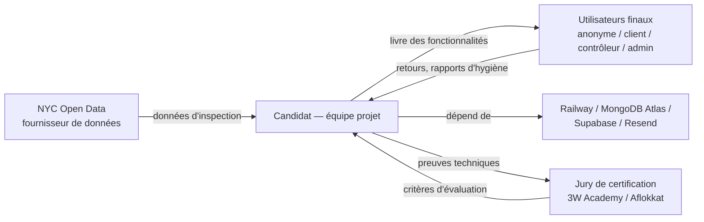

# Plan de changement

**Certification** : RNCP niveau 7 — Expert en informatique et système d'information (3W Academy)
**Bloc** : 2 — Piloter et manager les projets informatiques
**Livrable** : Plan de changement
**Candidat** : Arnaud Thery
**Projet** : `restaurant-analytics`

> Comme pour les Blocs 1.3, 2.1-2.3, ce document est traité en solo sur la base de `restaurant-analytics`, alors que le référentiel prévoit une évaluation en groupe de 3 — choix assumé, documenté dans `CHECKLIST.md`, en attendant une réponse d'Aflokkat sur ce point. Un contexte solo ne supprime pas la notion de parties prenantes : il change simplement leur nature (pas de collègues, mais des dépendances externes réelles) — c'est ce que ce document rend explicite plutôt que de le contourner.

---

## 1. Parties prenantes

### 1.1 Équipe projet

Une seule personne : le candidat, qui cumule tous les rôles habituellement répartis dans une équipe.

| Casquette | Responsabilité |
|---|---|
| Product Owner | Priorisation des fonctionnalités, arbitrages de périmètre (ex. arrêt d'Elasticsearch) |
| Développeur | Implémentation, tests |
| Ops / SRE | Déploiement, supervision Railway, gestion des coûts d'infrastructure |
| Référent sécurité | Durcissement JWT/RGPD, revue des dépendances, scan de secrets |
| QA | Écriture et maintenance de la suite de tests, revue des PR avant fusion |

### 1.2 Parties prenantes externes (distinctes de l'équipe projet)

*(diagramme validé avec `mmdc`)*

| Partie prenante | Rôle vis-à-vis du projet | Attente principale |
|---|---|---|
| Utilisateurs finaux (4 profils) | Consommateurs du service | Disponibilité, exactitude des données, sécurité des comptes |
| NYC Open Data | Fournisseur de données source | Aucune, relation à sens unique (API publique gratuite) |
| Railway / MongoDB Atlas / Supabase / Resend | Fournisseurs d'infrastructure | Paiement des factures, respect des quotas d'usage |
| Jury de certification (3W Academy / Aflokkat) | Évaluateur externe | Preuves techniques vérifiables, conformité au référentiel |

---

## 2. Types de messages selon les parties prenantes

| Partie prenante | Type de message | Canal |
|---|---|---|
| Utilisateurs finaux | Confirmation d'action (bookmark, rapport soumis), erreurs | Notifications toast in-app (`showToast()`), emails transactionnels (Resend) |
| Utilisateurs finaux | Nouveauté / évolution du service | Numéro de version affiché en pied de page (`v2.4.1`), `CHANGELOG.md` public sur GitHub |
| NYC Open Data | Aucun message sortant — uniquement des requêtes de lecture programmées | — |
| Fournisseurs d'infrastructure | Alertes d'incident, dépassement de quota | Dashboards Railway/Supabase, emails automatiques des fournisseurs |
| Jury de certification | Preuves techniques structurées | Dossiers `certification/*.md`, code source public sur GitHub, démo live |
| Futur mainteneur (soi-même après une pause, ou un tiers hypothétique) | Contexte de reprise en main | `CLAUDE.md`, `docs/`, `CHANGELOG.md` — approche déjà identifiée comme mesure face au risque S1 (Bloc 1.3) |

---

## 3. Plan de communication

Le projet n'a pas de réunions au sens classique (pas d'équipe à synchroniser), mais des points de communication réels, outillés :

| Outil | Usage |
|---|---|
| `CHANGELOG.md` | Historique public et daté de chaque changement livré — sert de compte rendu d'avancement asynchrone |
| Pull requests GitHub | Chaque fonctionnalité documentée (description, plan de test) avant fusion — équivalent d'un point de revue, même en solo (auto-revue disciplinée par la CI obligatoire) |
| `docs/superpowers/specs/` et `plans/` | Décisions de conception argumentées, consultables a posteriori |
| Lien "Signaler un problème" (bouton flottant + pied de page) | Canal de retour utilisateur direct vers une issue GitHub |
| Swagger UI (`/swagger-ui.html`) | Communication technique de l'API vers un développeur tiers potentiel |

---

## 4. Plannings

Planning macro déjà établi au Bloc 2.3 (Gantt des 7 phases, `bloc2-3-dossier-planification-bilan.md`, section 1.1). Ce plan de changement s'appuie dessus sans le dupliquer : chaque nouvelle fonctionnalité suit le cycle court spec → plan → implémentation → revue CI → documentation (quelques jours à deux semaines par fonctionnalité, cf. historique `CHANGELOG.md`), imbriqué dans les phases macro.

---

## 5. Indicateurs d'avancement

| Indicateur | Source | Fréquence |
|---|---|---|
| Version applicative (`app.semver`) | `application.properties`, affichée en pied de page et via `GET /api/restaurants/health` | À chaque release |
| Statut CI (build, tests, couverture) | GitHub Actions, badge de couverture JaCoCo sur chaque PR | À chaque push/PR |
| Entrées `CHANGELOG.md` | Dépôt Git | À chaque fonctionnalité livrée |
| Coût d'infrastructure observé | Métriques Railway (mémoire, services actifs) | Revue ponctuelle, formalisation trimestrielle préconisée (Bloc 1.3, §5) |
| Couverture de code | Rapport JaCoCo (seuil CI 38 %, mesuré 43 %) | À chaque build |

---

## 6. Plan de formation et de valorisation des connaissances

### 6.1 Montée en compétences (auto-portée)

Sans équipe à former, la montée en compétences est individuelle et documentée plutôt qu'implicite :

- **Changement de méthode en cours de projet** — passage du scaffolding GSD au workflow Superpowers (mai 2026, détaillé au Bloc 2.3) : une compétence méthodologique acquise et adoptée durablement, pas juste testée puis oubliée.
- **Montée en compétence sécurité** — accumulation progressive des mesures du Bloc 4A.1 (JWT, RGPD, scan de secrets, sauvegardes chiffrées), chacune documentée avec sa justification dans `CHANGELOG.md` plutôt qu'appliquée sans trace.
- **Veille technique continue** — le Bloc 1.1 (dossier de veille) constitue lui-même un livrable de cette activité de formation continue.

### 6.2 Valorisation des connaissances

| Support | Rôle de valorisation |
|---|---|
| `docs/` (architecture, api, ui, configuration, deployment) | Connaissance technique transmissible à un tiers, tenue à jour à chaque fonctionnalité |
| `docs/superpowers/specs/` et `plans/` | Justification des choix de conception, réutilisable pour des décisions futures similaires |
| `certification/` | Formalisation académique des compétences acquises — ce dossier lui-même en est un exemple |
| `CLAUDE.md` | Contexte condensé pour une reprise de projet rapide, y compris par le candidat lui-même après une pause |

---

## Renvoi croisé

- Note de cadrage : [`bloc2-2-note-de-cadrage.md`](bloc2-2-note-de-cadrage.md)
- Dossier de planification + bilan (Gantt macro) : [`bloc2-3-dossier-planification-bilan.md`](bloc2-3-dossier-planification-bilan.md)
- Analyse stratégique (risque S1, key-person) : [`bloc1-3-analyse-strategique.md`](bloc1-3-analyse-strategique.md)
