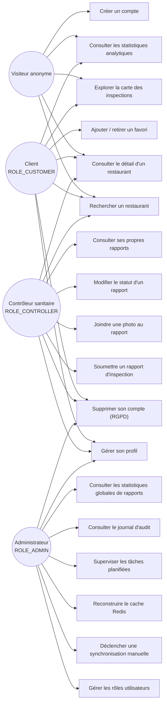
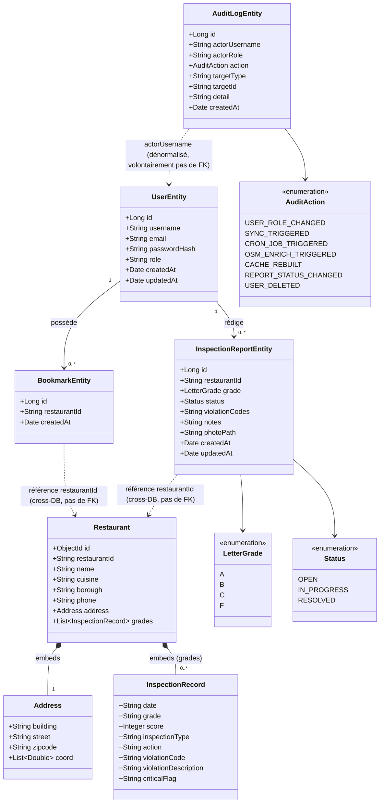
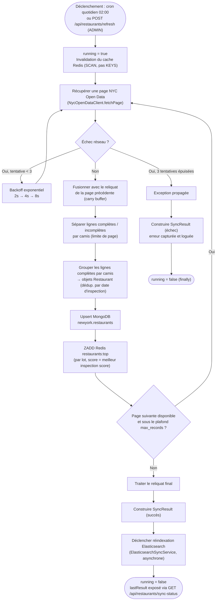

# Dossier de conception d'une application informatique

**Certification** : RNCP niveau 7 — Expert en informatique et système d'information (3W Academy)
**Bloc** : 3 — Concevoir et développer une application informatique
**Livrable** : Dossier de conception (évaluation individuelle)
**Candidat** : Arnaud Thery
**Application conçue** : `restaurant-analytics`

Ce dossier s'appuie sur `docs/architecture.md` comme socle technique et le complète par une modélisation UML (cas d'utilisation, classes, activité) absente de la documentation courante du projet.

---

## 1. Décomposition de l'application

`restaurant-analytics` est structuré en couches classiques d'une application Spring Boot, avec une particularité : **deux bases de données hétérogènes** cohabitent sans ORM unifié — MongoDB (driver brut, sans Spring Data Mongo) pour les données publiques NYC Open Data, PostgreSQL (JPA/Hibernate) pour les données applicatives (comptes, favoris, rapports, audit).

| Couche | Package | Rôle |
|---|---|---|
| Présentation HTTP | `controller/` | Endpoints REST, validation d'entrée, mapping DTO ↔ réponse JSON |
| Vues serveur | `controller/ViewController` + `resources/templates/` | Pages Thymeleaf (dashboard, profil, carte, analytics) |
| Sécurité | `security/` | JWT (émission/validation), rate limiting (Bucket4j), filtre d'authentification |
| Logique métier | `service/` | `RestaurantService`, `AuthService`, `AuditService` |
| Accès données MongoDB | `dao/` | `RestaurantDAO`, `AnalyticsDAO` (+ `Impl`), pipelines d'agrégation BSON |
| Accès données PostgreSQL | `repository/` | Interfaces Spring Data JPA (`UserRepository`, `BookmarkRepository`, `ReportRepository`, `AuditLogRepository`) |
| Cache | `cache/` | `RestaurantCacheService` (Redis, TTL 3600s, cache-aside) |
| Synchronisation externe | `sync/` | `NycOpenDataClient`, `SyncService`, `ElasticsearchSyncService`, `CronScheduler` |
| Modèle MongoDB | `domain/` | POJOs bruts (`Restaurant`, `Address`, `InspectionRecord`) |
| Modèle PostgreSQL | `entity/` | Entités JPA (`UserEntity`, `BookmarkEntity`, `InspectionReportEntity`, `AuditLogEntity` + enums) |
| Transfert | `dto/` | Objets de requête/réponse ne correspondant à aucune persistance directe |

Cette séparation `domain/` (Mongo) vs `entity/` (JPA) — plutôt qu'un modèle unique — reflète un choix assumé : les données NYC Open Data sont en lecture quasi-exclusive et à fort volume (agrégations), tandis que les données applicatives sont transactionnelles et bénéficient des garanties ACID de PostgreSQL. Le détail de ce choix est justifié dans le dossier technique (Bloc 3.2, section 1.2).

---

## 2. Diagramme de cas d'utilisation

Le système RBAC est **plat, non hiérarchique** : un utilisateur porte un rôle unique (`UserEntity.role`, chaîne simple, pas d'enum ni de hiérarchie Spring `RoleHierarchy`). Un `ADMIN` n'hérite donc pas automatiquement des capacités d'un `CONTROLLER` — un compte `ROLE_ADMIN` ne peut pas soumettre de rapport d'inspection (`POST /api/reports` exige `hasRole('CONTROLLER')`, correspondance stricte). Ce choix de conception, plutôt qu'un défaut, est documenté ici pour qu'il ne soit pas confondu avec un oubli.

**Lecture du diagramme** : les flèches partant de chaque acteur représentent les capacités effectivement accessibles à son rôle, telles que définies dans `SecurityConfig` (règles au niveau du filtre HTTP) et les annotations `@PreAuthorize` au niveau des méthodes de contrôleur. Le détail endpoint par endpoint est documenté dans `docs/api.md` ; ce diagramme en donne la vue fonctionnelle.

---

## 3. Diagramme de classes

Le modèle de données est scindé en deux sous-domaines qui ne partagent aucune relation JPA/ORM directe — seule une convention de clé étrangère par chaîne de caractères (`restaurantId`) relie les entités PostgreSQL aux documents MongoDB, puisque MongoDB n'est pas dans le contexte de persistance JPA.

**Décisions de modélisation à noter** :

- `Address` et `InspectionRecord` n'ont pas d'identité propre (pas de `_id`) : ce sont des objets valeur, existentiellement dépendants de `Restaurant` (composition UML, losange plein). Un document `Restaurant` complet est toujours upserté en un seul appel MongoDB — cohérent avec le modèle document.
- `BookmarkEntity` et `InspectionReportEntity` portent une vraie relation JPA `@ManyToOne` vers `UserEntity` (association, cardinalité 1–N) : ce sont des données transactionnelles PostgreSQL, la cohérence référentielle native de la base est exploitée.
- `AuditLogEntity.actorUsername` est **volontairement** une chaîne dénormalisée et non une `@ManyToOne` vers `UserEntity`. Preuve dans le code : `UserController.deleteAccount()` réécrit `actorUsername` en `"[deleted-user]"` sur toutes les entrées d'audit existantes au lieu de les supprimer en cascade — l'historique d'audit doit survivre à la suppression du compte qui l'a produit (traçabilité RGPD, cf. Bloc 4A.1).
- `restaurantId` (dans `BookmarkEntity` et `InspectionReportEntity`) est une simple chaîne, pas une clé étrangère SQL : la cible vit dans une base différente (MongoDB), donc aucune contrainte d'intégrité référentielle n'est possible nativement. Ce choix est un compromis assumé (voir section 6, risque associé).

---

## 4. Diagramme d'activité — synchronisation NYC Open Data

Flux le plus représentatif du fonctionnement interne de l'application : il alimente à la fois MongoDB, le cache Redis et l'index Elasticsearch, et gère explicitement les défaillances réseau du fournisseur externe.

**Points de robustesse modélisés** :
- Le *carry buffer* évite qu'un restaurant dont les lignes d'inspection sont réparties sur deux pages consécutives de l'API ne soit persisté de façon incomplète.
- Le retry avec backoff exponentiel (3 tentatives, 2s/4s/8s) absorbe les indisponibilités transitoires du fournisseur externe (NYC Open Data, SLA informel — risque R7 du Bloc 4A.1) sans faire échouer tout le cycle de synchronisation pour une erreur réseau ponctuelle.
- `running=false` est garanti par un bloc `finally` (Java), donc exécuté même en cas d'échec — évite qu'un sync bloqué en erreur n'empêche indéfiniment tout sync ultérieur.
- La réindexation Elasticsearch n'est déclenchée **qu'en cas de succès** du sync Mongo, pour ne jamais indexer une donnée partielle.

Deux tâches planifiées complémentaires, hors de ce flux, s'exécutent après le sync nocturne (`CronScheduler`) : réchauffement du cache Redis à 02:30, réindexation Elasticsearch indépendante à 04:00 — toutes deux également déclenchables manuellement via `POST /api/admin/cron/run/{jobKey}` et supervisées via `GET /api/admin/cron/status`.

---

## 5. Fonctionnement de l'application

L'application suit un modèle **lecture-majoritaire, écriture-planifiée** : les données NYC Open Data (28 000+ restaurants) ne sont réécrites qu'une fois par jour par le flux décrit en section 4 ; le reste du trafic HTTP est en lecture, servi par un cache Redis en aval de MongoDB (pattern *cache-aside* — `RestaurantCacheService.getOrLoad*`, TTL 3600s). Les endpoints d'écriture applicative (favoris, rapports) sont peu fréquents en comparaison et vont directement en PostgreSQL sans passer par le cache.

**Cycle de vie d'une requête de lecture typique** (ex. `GET /api/restaurants/by-borough`) :
1. `RestaurantController` reçoit la requête (aucune authentification requise, endpoint public).
2. `RestaurantService` interroge `RestaurantCacheService.getOrLoad(key, loader)` : cache hit → retour immédiat depuis Redis ; cache miss → exécution du `loader` (agrégation MongoDB via `RestaurantDAO`/`AnalyticsDAO`), résultat mis en cache avec TTL avant d'être retourné.
3. `ResponseUtil.successResponse()` formate la réponse JSON.

**Cycle de vie d'une requête d'écriture typique** (ex. `POST /api/reports`, voir section 4 du Bloc 3.2 pour le détail du flux de rapport) :
1. `JwtAuthenticationFilter` valide le token, peuple le `SecurityContext` avec le rôle porté par le JWT.
2. `SecurityConfig` vérifie `hasRole('CONTROLLER')` avant que la requête n'atteigne le contrôleur.
3. `ReportController` valide les champs obligatoires du DTO (`restaurantId`, `grade`), résout l'utilisateur courant, persiste une `InspectionReportEntity` liée par relation JPA à `UserEntity`.
4. La réponse enrichit l'entité persistée avec des données lues à la volée depuis MongoDB (`restaurantName`, `borough`) — un exemple concret de jointure applicative entre les deux bases, puisqu'aucune jointure SQL n'est possible entre elles.

---

## 6. Données utilisées et structuration des informations échangées

| Flux | Format | Source → Destination |
|---|---|---|
| Import NYC Open Data | JSON (API Socrata) → POJO `NycApiRestaurantDto` → document BSON | API externe → MongoDB |
| Lecture API REST | Document BSON / ligne JPA → DTO de réponse → JSON | MongoDB / PostgreSQL → Client HTTP |
| Écriture rapport d'inspection | JSON (`ReportRequest`) → `InspectionReportEntity` | Client HTTP → PostgreSQL |
| Upload photo | `multipart/form-data` → fichier sur disque (`app.uploads.dir`) + chemin en base | Client HTTP → filesystem + PostgreSQL |
| Cache | Objet Java sérialisé (Redis) | MongoDB → Redis (TTL 3600s) → Client HTTP |

**Risque identifié et assumé** : l'absence de contrainte d'intégrité référentielle entre `restaurantId` (PostgreSQL, chaîne libre) et les documents MongoDB signifie qu'un favori ou un rapport peut référencer un `restaurantId` qui n'existe plus (ex. si un restaurant était retiré du jeu de données NYC Open Data — cas non observé en pratique, l'API ne supprime pas d'entrées historiques). Ce compromis est le prix du choix polyglotte (deux bases sans ORM unifié) et n'a pas justifié la complexité d'une synchronisation de cohérence applicative pour un projet de cette échelle.

---

## Renvoi croisé

- Justification technologique complète (pourquoi MongoDB + PostgreSQL plutôt qu'une base unique) : `docs/architecture.md`, section "Stack".
- Détail endpoint par endpoint : `docs/api.md`.
- Revue de code, stratégie de tests, plan de sécurité et de maintenance : dossier technique, Bloc 3.2 (`certification/bloc3-2-dossier-technique.md`).
